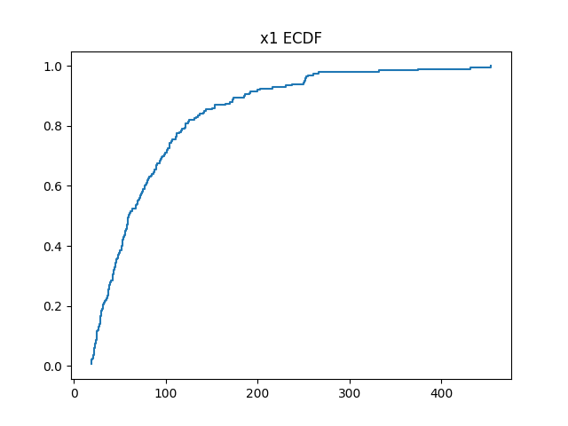
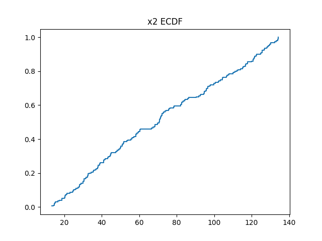
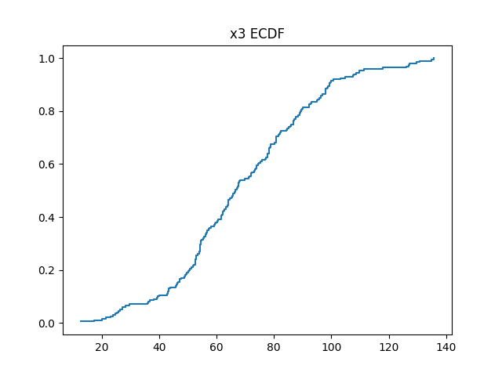
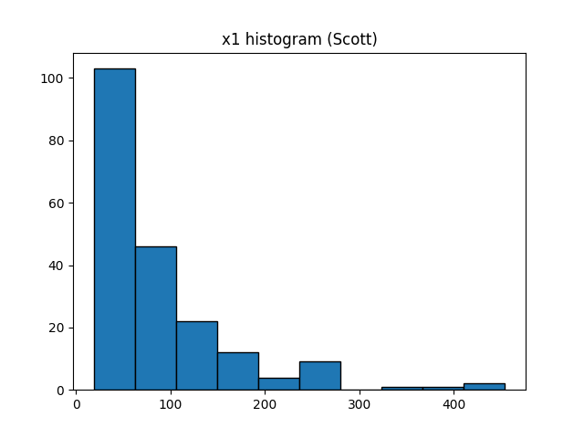
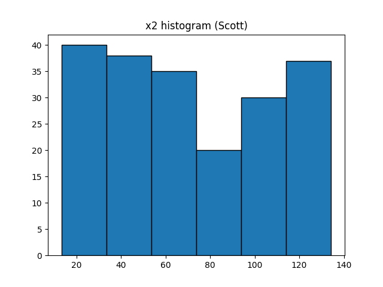
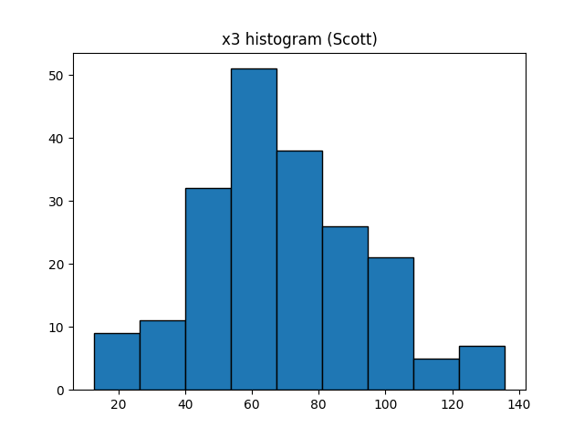

# Расчётно-графическая работа №1

## Вариант D-1

---

## 1. Первичное описание выборки

### 1.1 Вариационные ряды

|  X1  | X2 |  X3 |  X4  |
| ------ | ---- | ----- | ------ |
| 53.12 | 44.65 |24.78 | 155.61 |
|88.03|72.77|56.81|137.65|
|121.85|17.25|54.15|47.70|
|73.74|32.35|97.89|45.38|
|254.85|125.03|61.66|148.56|
|35.14|51.40|67.52|160.19|
|23.58|71.79|104.72|149.88|
|58.30|14.08|111.25|149.93|
|27.31|44.61|86.90|51.82|
|22.28|18.73|117.92|48.62|
|83.41|73.05|54.36|178.21| 
|67.50|14.66|93.12|47.17|

---

### 1.2 Эмпирическая функция распределения

#### Эмпирическая функция распределения Fn(X1)



#### Эмпирическая функция распределения Fn(X2)



#### Эмпирическая функция распределения Fn(X3)



---

### 1.3 Гистограммы

#### Для ряда X1 было выбрано по правилу Скотта

```math
h = \frac{3.5\,\sigma}{\sqrt[3]{n}} = \frac{3.5 * 73.9}{\sqrt[3]{50}} = 44.34
```

```math
k = \frac{max(x1)-min(x1)}{h}=10
```



#### Для ряда X2 было выбрано по правилу Скотта

```math
h = \frac{3.5\,\sigma}{\sqrt[3]{n}} = \frac{3.5 * 36.2}{\sqrt[3]{50}} = 21.71
```

```math
k = \frac{max(x2)-min(x2)}{h}=6
```



#### Для ряда X3 было выбрано по правилу Скотта

```math
h = \frac{3.5\,\sigma}{\sqrt[3]{n}} = \frac{3.5 * 24.5}{\sqrt[3]{50}} = 14.69
```

```math
k = \frac{max(x3)-min(x3)}{h}=9
```



---

### 2.3 Числовые характеристики

(см. вывод программы)

Основные:

- среднее
- дисперсия
- медиана
- квартили

---

### 2.4 Описание распределений

- X1: умеренная асимметрия, возможны выбросы
- X2: более равномерное распределение
- X3: положительная асимметрия
- X4: признаки неоднородности

---

## 3. Предположение о законе распределения

- X1 → нормальное распределение
- X2 → равномерное распределение
- X3 → экспоненциальное распределение

Обоснование:

- форма гистограммы
- асимметрия
- разброс значений

---

## 4. Оценивание параметров

### 4.1 Метод моментов

Используются:

- $E[X]$
- $D[X]$

---

### 4.2 Метод максимального правдоподобия

Оценки получены численно (см. код)

---

### 4.3 Сравнение

Для нормального распределения оценки совпадают.
Для равномерного и экспоненциального есть различия.

---

## 5. Вероятность P(X > x0)

Выбрано:
```math
x_0 = \bar{x} + \hat{\sigma}
```
Сравниваются:

- эмпирическая вероятность
- теоретическая

---

## 6. Сгруппированные оценки

Использованы интервалы гистограммы.
Результаты близки к исходным.

---

## 7. Доверительные интервалы

Уровень доверия: $0.95$

### Для всех

- асимптотический интервал для среднего

### Для нормального распределения

- точный интервал для $\mu$
- точный интервал для $\sigma^2$

---

## 8. Анализ X4

Наблюдается:

- широкий разброс
- возможная смесь распределений

Вывод: данные неоднородны.

---

## 9. Итог

- X1: нормальное распределение
- X2: равномерное
- X3: экспоненциальное

Оценки параметров согласуются между методами.
Доверительные интервалы имеют разумную ширину.

Практически: модели адекватно описывают данные, кроме X4.
