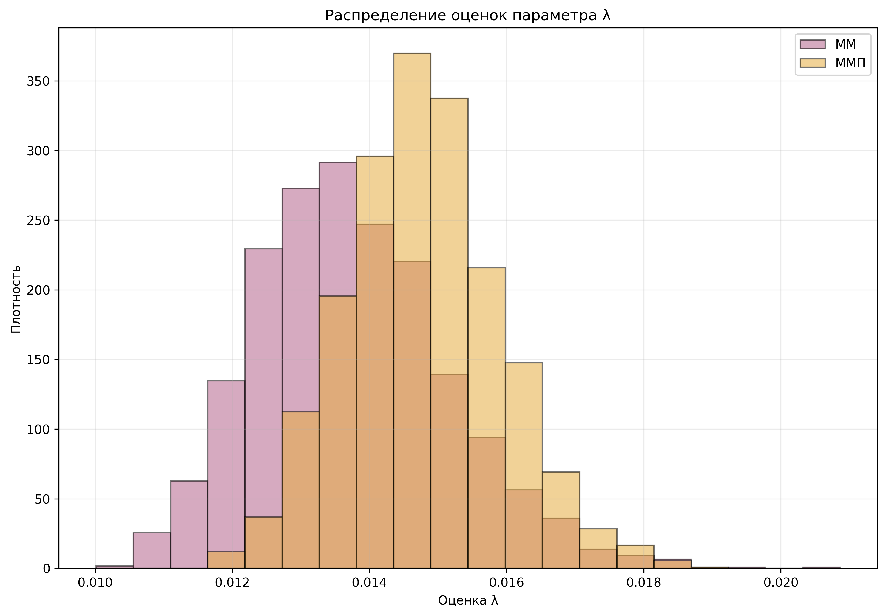
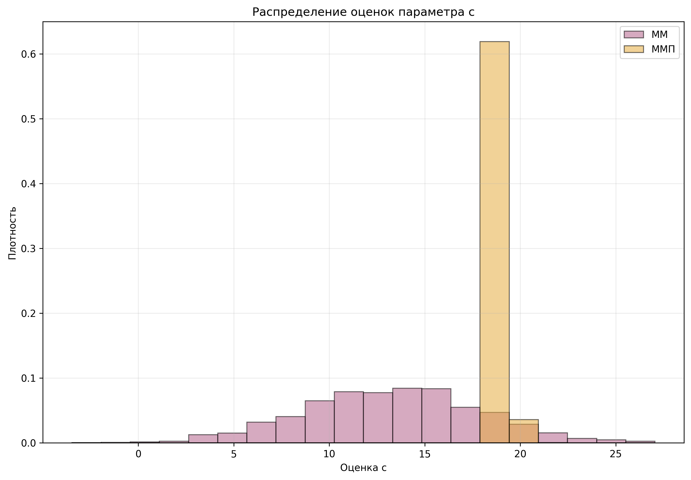
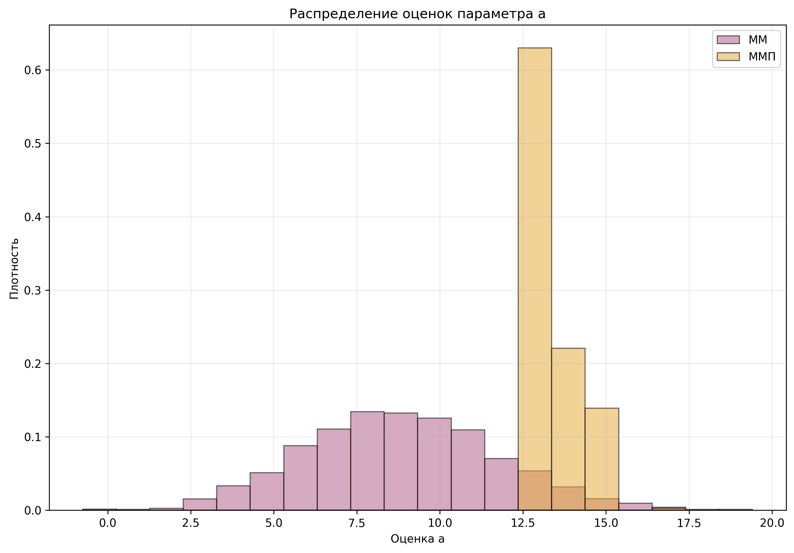
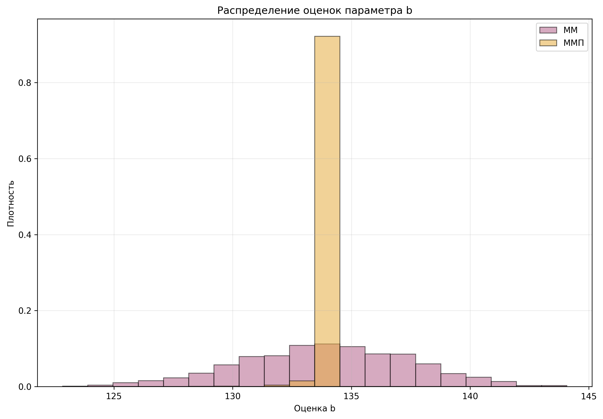
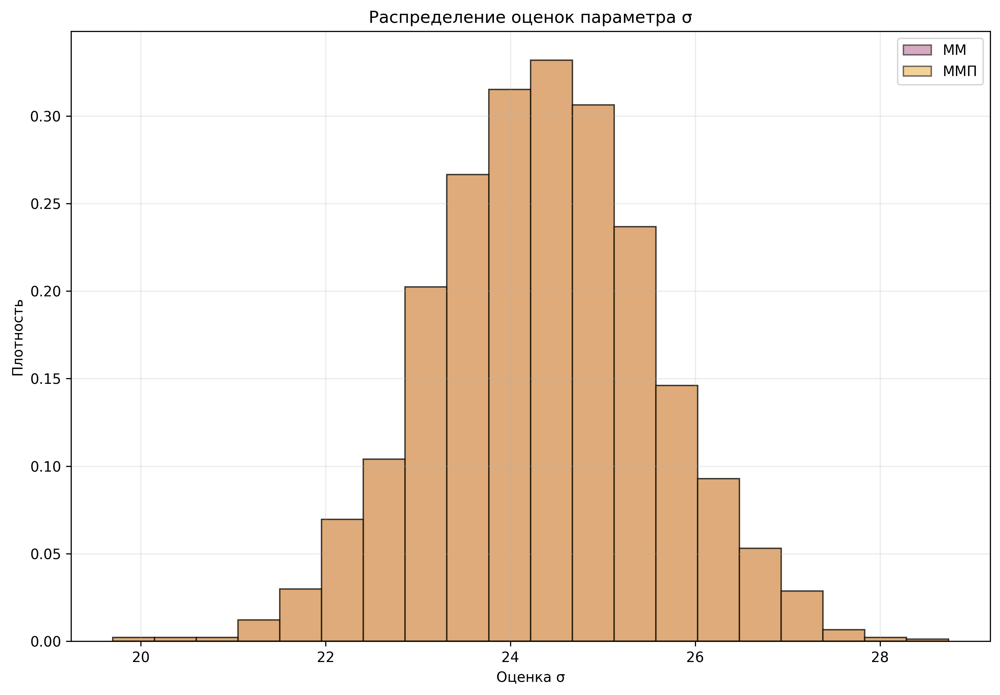
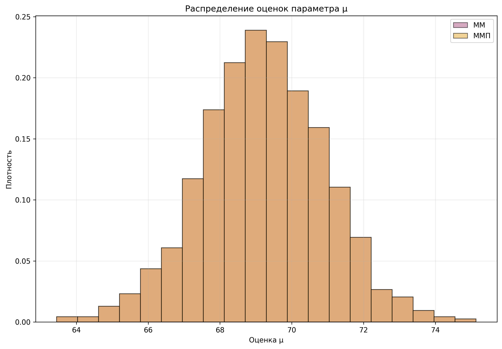

# Расчётно-графическая работа №1

## Вариант D-1

---

## 1. Первичное описание выборки

### Вариационные ряды

Полные вариационные ряды для X<sub>1</sub>, X<sub>2</sub>, X<sub>3</sub> строятся сортировкой наблюдений по возрастанию.

| X1 | X2 | X3 |
| ------ | ---- | ----- |
| 53.12 | 44.65 | 24.78 |
| 88.03 | 72.77 | 56.81 |
| 121.85 | 17.25 | 54.15 |
| 73.74 | 32.35 | 97.89 |
| 254.85 | 125.03 | 61.66 |
| 35.14 | 51.40 | 67.52 |
| 23.58 | 71.79 | 104.72 |
| 58.30 | 14.08 | 111.25 |
| 27.31 | 44.61 | 86.90 |
| 22.28 | 18.73 | 117.92 |
| 83.41 | 73.05 | 54.36 |
| 67.50 | 14.66 | 93.12 |

---

### Эмпирическая функция распределения

#### Эмпирическая функция распределения F<sub>n</sub>(X<sub>1</sub>)


#### Эмпирическая функция распределения F<sub>n</sub>(X<sub>2</sub>)


#### Эмпирическая функция распределения F<sub>n</sub>(X<sub>3</sub>)


---

### Гистограммы

Используем правило Скотта:
```math
h = \frac{3.5\sigma}{\sqrt[3]{n}}, \qquad n=200
```
#### Для ряда X1
```math
h = \frac{3.5 \cdot 73.9}{\sqrt[3]{200}} \approx 44.35
```
```math
k = 10
```


#### Для ряда X2
```math
h = \frac{3.5 \cdot 36.2}{\sqrt[3]{200}} \approx 21.72
```
```math
k = 6
```


#### Для ряда X3
```math
h = \frac{3.5 \cdot 24.5}{\sqrt[3]{200}} \approx 14.70
```
```math
k = 9
```


---

### Числовые характеристики

| Характеристика | X1 | X2 | X3 |
|---|---:|---:|---:|
| Выборочное среднее | 86.71065 | 71.45275 | 69.29580 |
| Смещённая дисперсия | 5463.23254 | 1310.40342 | 599.91782 |
| Несмещённая дисперсия | 5490.68597 | 1316.98836 | 602.93248 |
| Смещённое стандартное отклонение | 73.91368 | 36.19949 | 24.49322 |
| Несмещённое стандартное отклонение | 74.09916 | 36.29033 | 24.55468 |
| Медиана | 59.55 | 70.69 | 66.61 |
| Первый квартиль | 37.6875 | 38.8975 | 52.9175 |
| Третий квартиль | 106.17 | 103.6075 | 86.1450 |
---

### Краткое описание формы распределения

#### Для X<sub>1</sub>
```math
\bar{x}_1 = 86.71 > Me_1 = 59.55
```
Правосторонняя асимметрия, длинный правый хвост, возможны выбросы.

#### Для X<sub>2</sub>
```math
\bar{x}_2 = 71.45 \approx Me_2 = 70.69
```
Форма близка к симметричной, значения ограничены сверху и снизу.

#### Для X<sub>3</sub>
```math
\bar{x}_3 = 69.30 \approx Me_3 = 66.61
```
Слабая асимметрия, форма близка к нормальной.

---

## 2. Предположение о виде закона распределения

#### Ряд X1 - экспоненциальное распределение
- первый столбец заметно выше остальных
- далее частоты убывают
- имеются редкие большие значения, образующие хвост


#### Ряд X2 - равномерное распределение
- частоты в интервалах близки друг к другу
- выраженного хвоста нет
- значения ограничены снизу и сверху


#### Ряд X3 - нормальное распределение
- имеется один центральный максимум
- частоты уменьшаются к левому и правому краям
- форма близка к симметричной


---

## 3. Оценивание параметров: метод моментов и метод максимального правдоподобия

### Столбец X<sub>1</sub> экспоненциальное распределения

#### Метод моментов

Для сдвинутого экспоненциального распределения:
```math
E[X]=c+\frac{1}{\lambda}, \qquad D[X]=\frac{1}{\lambda^2}
```
Приравниваем:
```math
c+\frac{1}{\lambda}=\bar{x}, \qquad \frac{1}{\lambda^2}=S^2
```
Тогда
```math
\hat{\lambda}=\frac{1}{S}, \qquad \hat{c}=\bar{x}-S
```
Подстановка:
```math
\hat{\lambda}=\frac{1}{73.91368}\approx 0.01353
```
```math
\hat{c}=86.71065-73.91368\approx 12.79697
```
#### Метод максимального правдоподобия

```math
\hat{c}=x_{1}=\min X<sub>1</sub>=18.6
```
```math
\hat{\lambda}=\frac{n}{\sum_{i=1}^{n}(x_i-x_{(1)})}=\frac{1}{\bar{x}-x_{(1)}}=\frac{1}{86.7-18.6}\approx0.01468
```
#### Сравнение

- $\hat{\lambda}\approx 0.01353, \qquad \hat{c}\approx 12.79697$
- $\hat{\lambda}\approx 0.01468, \qquad \hat{c}\approx 18.6$



---



---

### Столбец X<sub>2</sub> равномерное распределение

#### Метод моментов

```math
E[X]=\frac{a+b}{2}, \qquad D[X]=\frac{(b-a)^2}{12}
```
Приравниваем:
```math
\frac{a+b}{2}=\bar{x}, \qquad \frac{(b-a)^2}{12}=S^2
```
Тогда
```math
\hat{a}=\bar{x}-\sqrt{3S^2}, \qquad \hat{b}=\bar{x}+\sqrt{3S^2}
```
Подстановка:
```math
\hat{a}=71.45275-\sqrt{3\cdot 1310.40342}\approx 8.75339
```
```math
\hat{b}=71.45275+\sqrt{3\cdot 1310.40342}\approx 134.15211
```
#### Метод максимального правдоподобия

```math
\hat{a}=x_{(1)}=\min X<sub>2</sub>=13.23
```
```math
\hat{b}=x_{(n)}=\max X<sub>2</sub>=134.33
```
#### Сравнение

- $\hat{a}\approx 8.753 \qquad \hat{b}\approx 134.15211$
- $\hat{a}\approx 13.23 \qquad \hat{b}\approx 134.33$



---




---

### Столбец X<sub>3</sub> нормальное распределение

#### Метод моментов

```math
E[X]=\mu, \qquad D[X]=\sigma^2
```
Следовательно
```math
\hat{\mu}=\bar{x}=69.29
```
```math
\hat{\sigma}^2=S^2=599.91
```
```math
\hat{\sigma}=24.49
```
#### Метод максимального правдоподобия

```math
\hat{\mu}=\bar{x}=69.29
```
```math
\hat{\sigma}^2=S^2=599.91
```
#### Сравнение

Оба метода получают одинаковые значения 69.29 и 599.91 соответсвенно


---



---

## 4. Оценивание параметрической вероятности двумя способами


### Столбец X<sub>1</sub> экспонициального распределения

```math
X<sub>1</sub> \sim Exp_{\lambda,c}.
```
По ММП:
```math
\hat c=18.6,
```
```math
\hat\lambda \approx 0.01468.
```
Порог:
```math
x_0=\bar X<sub>1</sub>+\hat\sigma_1
=86.71065+74.09916
\approx 160.80981.
```
Эмпирическая оценка:
```math
\hat p_{\text{emp}}=\frac{26}{200}=0.13.
```
Параметрическая оценка:
```math
\hat p_{\text{par}}=e^{-\hat\lambda(x_0-\hat c)}
=e^{-0.01468(160.80981-18.6)}
\approx 0.12394.
```
Сравнение:
```math
\hat p_{\text{emp}}=0.13,\qquad
\hat p_{\text{par}}\approx 0.12394.
```
Расхождение мало:
```math
|0.13-0.12394|\approx 0.00606.
```
Следовательно, для X<sub>1</sub> выбранная модель хорошо описывает вероятность больших значений.

---

### Для столбца X<sub>2</sub>

Для X<sub>2</sub> выбрана модель равномерного распределения
```math
X<sub>2</sub> \sim U[a,b].
```
По ММП:
```math
\hat a=13.23,
```
```math
\hat b=134.33.
```
Порог:
```math
x_0=\bar X<sub>2</sub>+\hat\sigma_2
=71.45275+36.29033
\approx 107.74308.
```
Эмпирическая оценка:
```math
\hat p_{\text{emp}}=\frac{44}{200}=0.22.
```
Параметрическая оценка:
```math
\hat p_{\text{par}}=\frac{\hat b-x_0}{\hat b-\hat a}
=\frac{134.33-107.74308}{134.33-13.23}
\approx 0.21955.
```
Сравнение:
```math
\hat p_{\text{emp}}=0.22,\qquad
\hat p_{\text{par}}\approx 0.21955.
```
Расхождение очень мало:
```math
|0.22-0.21955|\approx 0.00045.
```
Следовательно, для X<sub>2</sub> равномерная модель очень хорошо согласуется с выборкой.

---

### Для столбца X<sub>3</sub>

Для X<sub>3</sub> выбрана нормальная модель
```math
X<sub>3</sub> \sim N(\mu,\sigma^2).
```
По ММП:
```math
\hat\mu=69.29580,
```
```math
\hat\sigma\approx 24.49322.
```
Порог:
```math
x_0=\bar X<sub>3</sub>+\hat\sigma_3
=69.29580+24.55468
\approx 93.85048.
```
Эмпирическая оценка:
```math
\hat p_{\text{emp}}=\frac{33}{200}=0.165.
```
Параметрическая оценка:
```math
\hat p_{\text{par}}=
1-\Phi\left(\frac{x_0-\hat\mu}{\hat\sigma}\right)
=
1-\Phi\left(\frac{93.85048-69.29580}{24.49322}\right)
\approx 0.15805.
```
Сравнение:
```math
\hat p_{\text{emp}}=0.165,\qquad
\hat p_{\text{par}}\approx 0.15805.
```
Расхождение невелико:
```math
|0.165-0.15805|\approx 0.00695.
```
Следовательно, для X<sub>3</sub> нормальная модель достаточно хорошо описывает правый хвост распределения.

---

## 5. Оценка моментов по сгруппированной выборке

Для оценивания по сгруппированной выборке используем гистограммы, построенные ранее.
```math
\bar X_g=\frac{1}{n}\sum_{k=1}^{m} n_k \hat x_k,
```
```math
\bar\sigma_g^2=\frac{1}{n-1}\sum_{k=1}^{m} n_k(\hat x_k-\bar X_g)^2.
```
### Для столбца X<sub>1</sub>

Число интервалов:
```math
k=10.
```
Интервалы, середины и частоты:

| Интервал            |     Середина x_k |    Частота |
|---------------------|-----------------:|-----------:|
| [18.600;62.146]   |           40.373 |        103 |
| [62.146;105.692]  |           83.919 |         46 |
| [105.692;149.238] |          127.465 |         22 |
| [149.238;192.784] |          171.011 |         12 |
| [192.784;236.330] |          214.557 |          4 |
| [236.330;279.876] |          258.103 |          9 |
| [279.876;323.422] |          301.649 |          0 |
| [323.422;366.968] |          345.195 |          1 |
| [366.968;410.514] |          388.741 |          1 |
| [410.514;454.060] |          432.287 |          2 |

Оценка среднего:
```math
\bar X_g=\frac{1}{200}\sum_{k=1}^{10} n_k\hat x_k
\approx 88.27360.
```
Оценка дисперсии:
```math
\bar\sigma_g^2=\frac{1}{199}\sum_{k=1}^{10}n_k(\hat x_k-\bar X_g)^2
\approx 5374.30815.
```
Сравнение с исходными данными:
```math
\bar X<sub>1</sub>=86.71065,\qquad \hat\sigma_1^2=5490.68597.
```
Разности:
```math
\bar X_g-\bar X<sub>1</sub>\approx 1.56295,
```
```math
\bar\sigma_g^2-\hat\sigma_1^2\approx -116.37783.
```

Среднее по сгруппированной выборке получилось близким к исходному, а дисперсия намного меньше.

---

### Для столбца X<sub>2</sub>

Число интервалов:
```math
m=6.
```
Интервалы, середины и частоты:

| Интервал            |     Середина x_k |    Частота |
|---------------------|-----------------:|-----------:|
| [13.230;33.413]   |           23.322 |         40 |
| [33.413;53.597]   |           43.505 |         38 |
| [53.597;73.780]   |           63.688 |         35 |
| [73.780;93.963]   |           83.872 |         20 |
| [93.963;114.14]   |          104.055 |         30 |
| [114.147;134.330] |          124.238 |         37 |

Оценка среднего:
```math
\bar X_g=\frac{1}{200}\sum_{k=1}^{6} n_k\hat x_k
\approx 71.05525.
```
Оценка дисперсии:
```math
\bar\sigma_g^2=\frac{1}{199}\sum_{k=1}^{6}n_k(\hat x_k-\bar X_g)^2
\approx 1319.03984.
```
Сравнение с исходными данными:
```math
\bar X<sub>2</sub>=71.45275,\qquad \hat\sigma_2^2=1316.98836.
```
Разности:
```math
\bar X_g-\bar X<sub>2</sub>\approx -0.39750,
```
```math
\bar\sigma_g^2-\hat\sigma_2^2\approx 2.05147.
```
Оценка среднего практически совпала с исходной.  
Оценка дисперсии тоже очень близка к исходной; отличие несущественно.

---

### Для столбца X<sub>3</sub>

Число интервалов:
```math
m=9.
```
Интервалы, середины и частоты:

| Интервал            | Середина \hat x_k | Частота n_k |
|---------------------|---:|---:|
| [12.560;26.257]   | 19.408 | 9 |
| [26.257;39.953]   | 33.105 | 11 |
| [39.953;53.650]   | 46.802 | 32 |
| [53.650;67.347]   | 60.498 | 51 |
| [67.347;81.043]   | 74.195 | 38 |
| [81.043;94.740]   | 87.892 | 26 |
| [94.740;108.437]  | 101.588 | 21 |
| [108.437;122.133] | 115.285 | 5 |
| [122.133;135.830] | 128.982 | 7 |

Оценка среднего:
```math
\bar X_g=\frac{1}{200}\sum_{k=1}^{9} n_k\hat x_k
\approx 69.19572.
```
Оценка дисперсии:
```math
\bar\sigma_g^2=\frac{1}{199}\sum_{k=1}^{9}n_k(\hat x_k-\bar X_g)^2
\approx 624.40664.
```
Сравнение с исходными данными:
```math
\bar X<sub>3</sub>=69.29580,\qquad \hat\sigma_3^2=602.93248.
```
Разности:
```math
\bar X_g-\bar X<sub>3</sub>\approx -0.10008,
```
```math
\bar\sigma_g^2-\hat\sigma_3^2\approx 21.47417.
```
Оценка среднего почти совпадает с исходной.  
Оценка дисперсии немного больше исходной.

---

## 6. Доверительные интервалы

### Асимптотические интервалы для $E[X]$

#### Для X<sub>1</sub>
```math
I_{0.95}(E[X_1])=
\left(
86.71065-1.96\cdot \frac{74.09916}{\sqrt{200}},\ 
86.71065+1.96\cdot \frac{74.09916}{\sqrt{200}}
\right)
```
```math
I_{0.95}(E[X_1])\approx [76.44122;\ 96.98008]
```
#### Для X<sub>2</sub>
```math
I_{0.95}(E[X_2])=
\left(
71.45275-1.96\cdot \frac{36.29033}{\sqrt{200}},\ 
71.45275+1.96\cdot \frac{36.29033}{\sqrt{200}}
\right)
```
```math
I_{0.95}(E[X_2])\approx [66.42326;\ 76.48224]
```
#### Для X<sub>3</sub>
```math
I_{0.95}(E[X_3])=
\left(
69.29580-1.96\cdot \frac{24.55468}{\sqrt{200}},\ 
69.29580+1.96\cdot \frac{24.55468}{\sqrt{200}}
\right)
```
```math
I_{0.95}(E[X_3])\approx [65.89276;\ 72.69884]
```
---

### Точные доверительные интервалы для нормального столбца X<sub>3</sub>

Так как столбец $X_3$ был отнесён к нормальному распределению
```math
X_3 \sim N(\mu,\sigma^2),
```
для него строим точные доверительные интервалы.

Для $\mu$ при неизвестной $\sigma^2$


```math
I_{0.95}(\mu)\approx [65.87193;\ 72.71967]
```
Для $\sigma^2$

По формуле
```math
\sigma^2 \in
\left(
\frac{(n-1)\hat{\sigma}^2}{\chi^2_{1-\alpha/2;\,n-1}},\ 
\frac{(n-1)\hat{\sigma}^2}{\chi^2_{\alpha/2;\,n-1}}
\right)
```
при
```math
n=200,\qquad \hat{\sigma}^2=602.93248
```
получаем:
```math
I_{0.95}(\sigma^2)\approx [500.01551;\ 741.43480]
```
---

### Интерпретация

Построенный доверительный интервал задаёт диапазон значений параметра, согласованный с наблюдаемой выборкой на уровне доверия $0.95$.  
Это не означает, что параметр «попадает в интервал с вероятностью $0.95$», так как сам параметр считается фиксированным, а случайным является интервал, построенный по выборке.

---

## 7. Итоговый вывод

### Выбранные модели

```math
X<sub>1</sub> \sim Exp_{\lambda,c}
```
```math
X<sub>2</sub> \sim U[a,b]
```
```math
X<sub>3</sub> \sim N(\mu,\sigma^2)
```
### Оценки параметров

#### Для X<sub>1</sub>
```math
\hat{\lambda}\approx 0.01353, \qquad \hat{c}\approx 12.79697
```
#### Для X<sub>2</sub>
```math
\hat{a}\approx 8.75339, \qquad \hat{b}\approx 134.15211
```
#### Для X<sub>3</sub>
```math
\hat{\mu}=69.29580, \qquad \hat{\sigma}^2=599.91782
```
### 7.3 Итог

Для X<sub>1</sub> правосторонняя асимметрия, выбрана экспоненциальная модель со сдвигом.  
Для X<sub>2</sub> наиболее естественной является равномерная модель.  
Для X<sub>3</sub> данные хорошо согласуются с нормальным распределением.  
Наиболее устойчивые оценки и точные доверительные интервалы получены для X<sub>3</sub>.
